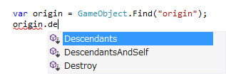
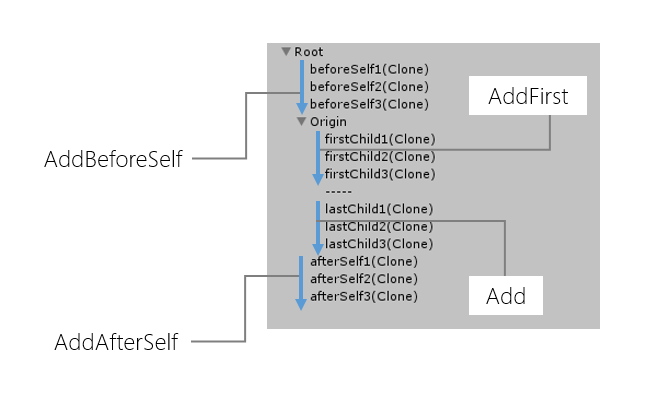
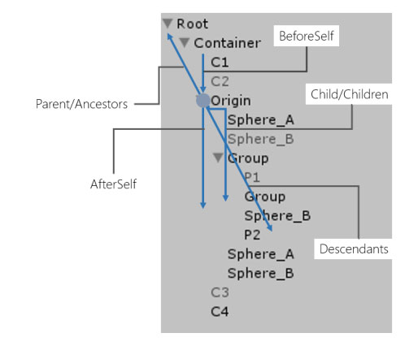

LINQ to GameObject
===
Efficiently traverse hierarchy and append GameObject.

How to use
---

All methods are extension of GameObject, using `Cute.Linq` then you can use all extension methods.

```csharp
using Cute.Linq;
```





```csharp
var root = GameObject.Find("root");
var cube = Resources.Load("Prefabs/PrefabCube") as GameObject;

// add do attach parent, set same layer and fix localPosition/Scale/Rotation.
// added child is cloned and returns child object.
var clone = root.Add(cube);

// choose sibling position and allow append multiple objects.
var clones = root.AddAfterSelfRange(new[] { cube, cube, cube });

// destroy do check null.
root.Destroy();
```

Add method's child is cloned. It is useful for instantiate prefab scenario. If you want to move only child, you can use(`MoveToLast`, `MoveToFirst`, `MoveToBeforeSelf`, `MoveToAfterSelf`) and (`MoveToLastRange`, `MoveToFirstRange`, `MoveToBeforeSelfRange`, `MoveToAfterSelfRange`) instead of Add.


API Reference : Traverse
---
All traverse methods can find inactive object. If not found, return type is `GameObject` methods return null, return type is `IEnumerable<GameObject>` methods return empty sequence.

Method | Description
-------| -----------
Parent                  | Gets the parent gObj of this gObj. If this gObj has no parent, returns null.
Child                    | Gets the first child gObj with the specified name. If there is no gObj with the speficided name, returns null.
Children               | Returns a collection of the child gObjs.
ChildrenAndSelf   | Returns a collection of gObjs that contain this gObj, and the child gObjs.
Ancestors              | Returns a collection of the ancestor gObjs of this gObj.
AncestorsAndSelf   | Returns a collection of gObjs that contain this element, and the ancestors of this gObj.
Descendants           | Returns a collection of the descendant gObjs.
DescendantsAndSelf | Returns a collection of gObjs that contain this gObj, and all descendant gObjs of this gObj.
BeforeSelf               | Returns a collection of the sibling gObjs before this gObj.
BeforeSelfAndSelf    | Returns a collection of gObjs that contain this gObj, and the sibling gObjs before this gObj.
AfterSelf                  | Returns a collection of the sibling gObjs after this gObj.
AfterSelfAndSelf      | Returns a collection of gObjs that contain this gObj, and the sibling gObjs after this gObj.

`Descendants` has `descendIntoChildren` overload, it stops traverse children when does not match condition.

API Reference : Operate
---
Operate methods have four optional parameter. `cloneType` configure cloned child GameObject's localPosition/Scale/Rotation, default copies original local transform. `setActive` configure activates/deactivates child GameObject. If null, doesn't set specified value. `specifiedName` configure set name of child GameObject. If null, doesn't set specified value. `setLayer` configure set child GameObject's layer same with parent, default doesn't set layer.

Method | Description
------- | -----------
Add | Adds the gObj/Component as children of this gObj. Target is cloned.
AddRange | Adds the gObj/Component as children of this gObj. Target is cloned.
AddFirst | Adds the gObj/Component as the first children of this gObj. Target is cloned.
AddFirstRange | Adds the gObj/Component as the first children of this gObj. Target is cloned.
AddBeforeSelf | Adds the gObj/Component before this gObj. Target is cloned.
AddBeforeSelfRange | Adds the gObj/Component before this gObj. Target is cloned.
AddAfterSelf | Adds the gObj/Component after this gObj. Target is cloned.
AddAfterSelfRange | Adds the gObj/Component after this gObj. Target is cloned.
Destroy | Destroy this gObj safety(check null).

There are `TransformCloneType` that used Add methods.

> If target is `RectTransform` always use `SetParent(parent, false)` and ignores `TransformCloneType`

Value | Description
------- | -----------
KeepOriginal | Set to same as Original. This is default of Add methods.
FollowParent | Set to same as Parent.
Origin          | Set to Position = zero, Scale = one, Rotation = identity.
DoNothing    | Position/Scale/Rotation as is.

MoveTo methods similar with Add but don't clone target.

Method | Description
------- | -----------
MoveToLast | Move the gObj/Component as children of this gObj.
MoveToLastRange | Move the gObj/Component as children of this gObj.
MoveToFirst | Move the gObj/Component as the first children of this gObj.
MoveToFirstRange | Move the gObj/Component as the first children of this gObj.
MoveToBeforeSelf | Move the gObj/Component before this gObj.
MoveToBeforeSelfRange | Move the gObj/Component before this gObj.
MoveToAfterSelf | Move the gObj/Component after this gObj.
MoveToAfterSelfRange | Move the gObj/Component after this gObj.

There are `TransformMoveType` that used MoveTo methods.

> If target is `RectTransform` always use `SetParent(parent, false)` and ignores `TransformMoveType`

Value | Description
------- | -----------
FollowParent | Set to same as Parent.
Origin | Set to Position = zero, Scale = one, Rotation = identity.
DoNothing | Position/Scale/Rotation as is. This is default of MoveTo methods.

Reference : Extensions
---
`IEnumerable<GameObject>` Extensions. If multiple GameObjects in the source collection have the same GameObject will be included multiple times in the result collection. To avoid this, use the `Distinct`(LINQ to Objects) method.

Method | Description
------- | -----------
Ancestors | Returns a collection of gObjs that contains the ancestors of every gObj in the source collection.
AncestorsAndSelf | Returns a collection of gObjs that contains every gObj in the source collection, and the ancestors of every gObj in the source collection.
Descendants | Returns a collection of gObjs that contains the descendant gObjs of every gObj in the source collection.
DescendantsAndSelf | Returns a collection of gObjs that contains every gObj in the source collection, and the descendent gObjs of every gObj in the source collection.
Children | Returns a filtered collection of the child gObjs of every gObj in the source collection. Only gObjs that have a matching name are included in the collection.
ChildrenAndSelf | Returns a collection of gObjs that contains every gObj in the source collection, and the child gObjs of every gObj in the source collection.
Destroy | Destroy every gObj in the source collection safety(check null).
OfComponent | Returns a collection of specified component in the source collection.

Axis
---
The concept of LINQ to GameObject is axis on tree.



Every traverse method returns `IEnumerable<GameObject>` and deferred exectuion. For example

```csharp
origin.Ancestors();   // Container, Root
origin.Children();    // Sphere_A, Sphere_B, Group, Sphere_A, Sphere_B
origin.Descendants(); // Sphere_A, Sphere_B, Group, P1, Group, Sphere_B, P2, Sphere_A, Sphere_B
origin.BeforeSelf(); // C1, C2
origin.AfterSelf();  // C3, C4
```

You can chain query(LINQ to Objects) and use some specified methods(`Destroy`, `OfComponent` and others).

```csharp
// destroy all filtered(tag == "foobar") objects
root.Descendants().Where(x => x.tag == "foobar").Destroy();

// destroy all cloned objects
origin.transform.root.gameObject
    .Descendants()
    .Where(x => x.name.EndsWith("(Clone)"))
    .Destroy();

// get FooScript under self childer objects and self
var fooScripts = root.ChildrenAndSelf().OfComponent<FooScript>();
```

> Note: LINQ to GameObject is optimized for iteration, returns struct enumerable and struct enumerator instead of `IEnumerable<GameObject>`.


Performance Tips
---
LINQ to GameObject is optimized heavily. Traverse methods returns hand optimized struct enumerator so it can avoid garbage when enumerate.

Some LINQ methods are optimized. `First`, `FirstOrDefault`, `ToArray` path through the optimized path.

LINQ to GameObject also provides `ToArrayNonAlloc`. It is like `Physics.RaycastNonAlloc` or `void GetComponentsInChildren<T>(List<T> results)` and reuse `List<T>`. You can reuse array for no garbage.

```csharp
GameObject[] array = new GameObject[0];

// travese on every update but no allocate memory
void Update()
{
    var size = origin.Children().ToArrayNonAlloc(ref array);
    for (int i = 0; i < size; i++)
    {
        var element = array[i];
    }
}
```

`ToArray` and `ToArrayNonAlloc` have five overloads. `()`, `(Func<GameObject, T> selector)`, `(Func<GameObject, bool> filter)`, `(Func<GameObject, bool> filter, Func<GameObject, T> selector)`, `(Func<GameObject, TState> let, Func<TState, bool> filter, Func<TState, T> selector)` for Optimize `Where().Select().ToArray()` pattern.

If you use simple iteration or use `ForEach` or `ToArrayNonAlloc`, LINQ to GameObject guarantees no gc allocate and performance is very fast.

If you use `DescendantsAndSelf().OfComponent<T>()`, it may possible to substitude `GetComponentsInChildren<T>` that is always fast than LINQ traverse(because LINQ traverse can not have native magics). So you can substitude native methods, use it. If you needs other query, use LINQ.

> Descendants(AndSelf) returns single Component on each GameObject, GetComponentsInChildren returns multiple Component on each GameObject, so behaviour is different. LINQ to GameObject's Descendants is heavily optimized, internal iterator of `ForEach` and `ToArray` is specialize tuned.
